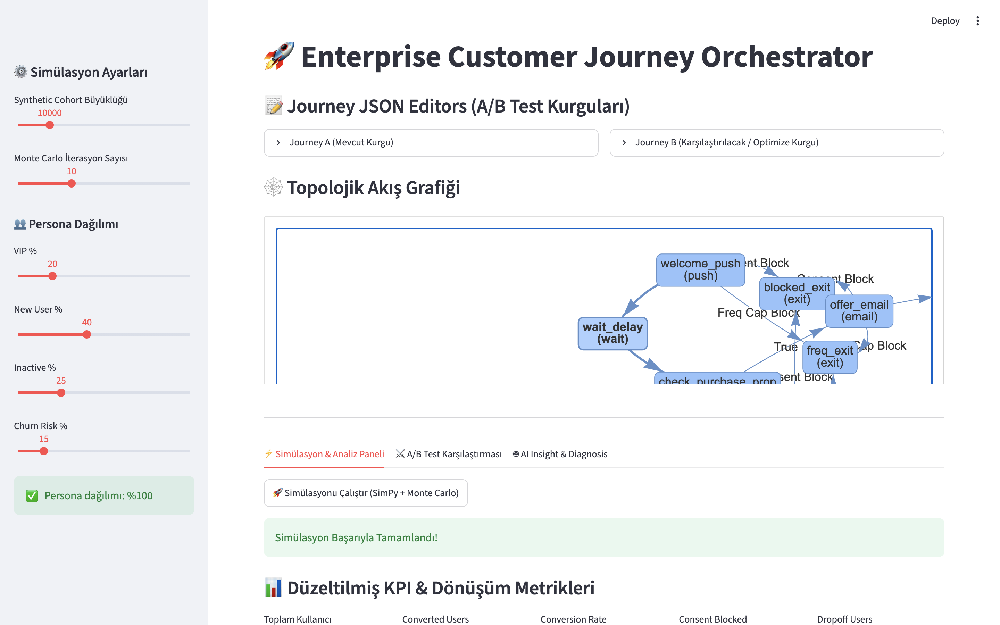
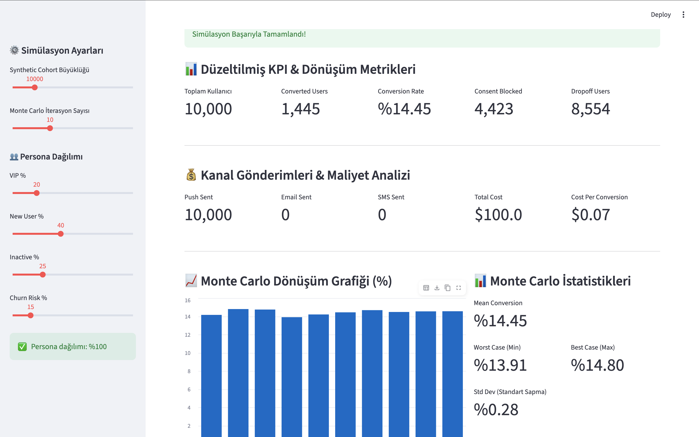
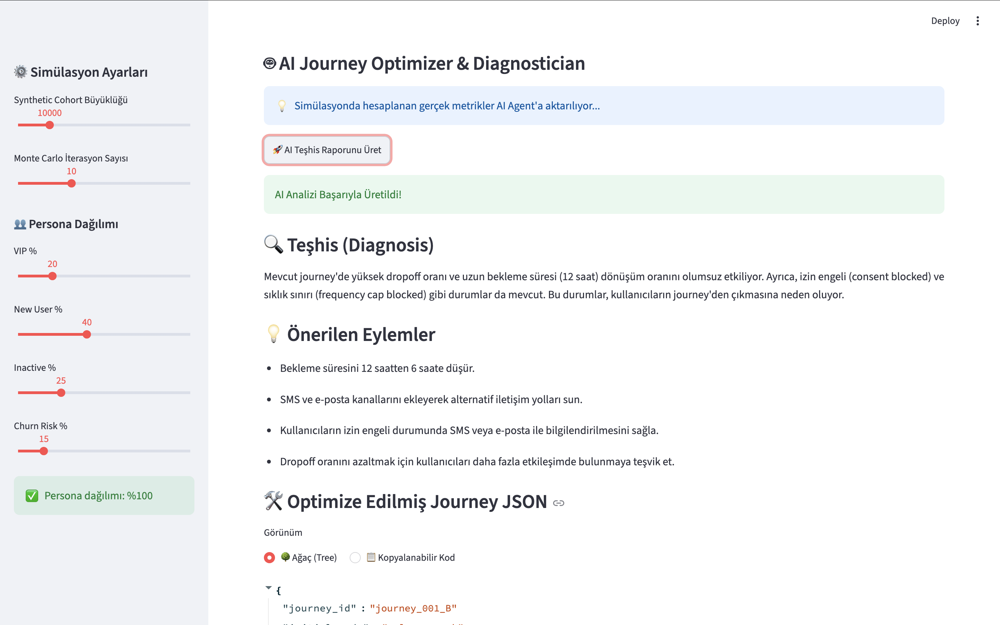
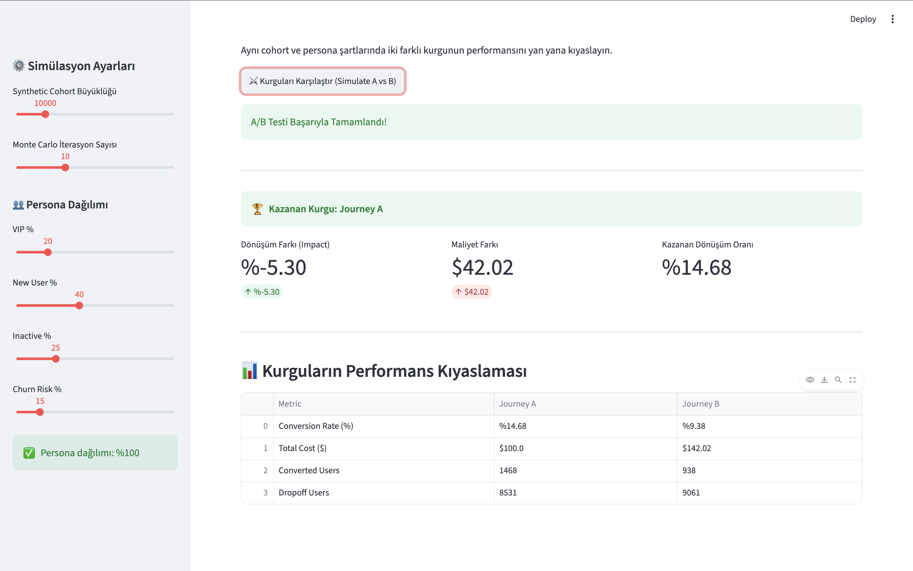

# customer_journey
Developed a customer journey simulation and validation platform using Python, SimPy, and Streamlit. The system validates journey structures, simulates customer interactions across multiple channels (Push, Email, SMS), and evaluates campaign performance through Monte Carlo analysis and business KPI tracking.
# 🚀 Enterprise Customer Journey Simulator & Validator

A simulation and validation platform for testing customer journeys **before deployment**. This project enables marketing teams to validate journey configurations, simulate customer behavior, forecast campaign performance, and analyze business KPIs through Monte Carlo simulations — all backed by an AI-powered diagnostic layer.


---

## 📑 Table of Contents

- [Project Overview](#-project-overview)
- [Dashboard Preview](#-dashboard-preview)
- [Features](#-features)
- [System Architecture](#-system-architecture)
- [Technology Stack](#-technology-stack)
- [Example Metrics](#-example-metrics)
- [Installation](#-installation)
- [Run Application](#-run-application)
- [Future Improvements](#-future-improvements)
- [Author](#-author)

---

## 🧭 Project Overview

Customer journeys are widely used in marketing automation platforms to engage users through channels such as **Push Notifications**, **Email**, and **SMS**.

Deploying a journey without validation can lead to configuration errors, low conversion rates, unnecessary operational costs, and a poor customer experience. This project addresses that gap by letting teams **simulate a journey against a synthetic customer cohort before it ever goes live**.

The platform provides:

- ✅ Journey validation before deployment
- 🧑‍🤝‍🧑 Customer behavior simulation across configurable personas
- 📈 Conversion forecasting
- 💰 Cost estimation
- 📊 KPI monitoring
- 🎲 Monte Carlo scenario analysis
- 🤖 AI-powered journey diagnosis and optimization suggestions
- 🆚 A/B journey comparison

---

## 🖼️ Dashboard Preview

**Journey builder with topological flow graph, persona distribution, and simulation controls:**



**Simulation results — KPIs, channel cost breakdown, and Monte Carlo conversion distribution:**



**AI Journey Optimizer & Diagnostician — automated diagnosis and optimized journey suggestions:**



**A/B test comparison between two journey configurations:**



---

## ✨ Features

### Journey Validation
- JSON Schema validation
- Required field verification
- Channel configuration checks
- Journey structure validation

### Graph Validation
- Journey graph construction using **NetworkX**
- Detection of disconnected nodes
- Detection of invalid transitions
- Workflow integrity verification

### Customer Simulation
- **SimPy**-based discrete event simulation
- Configurable customer personas (VIP, New User, Inactive, Churn Risk)
- Multi-channel communication support (Push, Email, SMS)
- Realistic customer progression through journey steps, wait states, and exit/block conditions

### Monte Carlo Analysis
- Multiple simulation runs (configurable iteration count)
- Conversion probability estimation
- Performance distribution analysis (mean, std dev, best/worst case)
- Scenario comparison across runs

### AI Journey Optimizer & Diagnostician
- Automated diagnosis of journey bottlenecks (e.g., long wait times, high drop-off, consent/frequency-cap blocks)
- Actionable, AI-generated optimization suggestions
- Auto-generated optimized journey JSON (tree view + copyable code)

### A/B Journey Comparison
- Side-by-side simulation of two journey configurations under identical cohort/persona conditions
- Conversion rate, cost, and drop-off comparison
- Automatic "winning journey" determination

### KPI Tracking
- Conversion Rate
- Revenue
- Campaign Cost
- Cost per Conversion
- Consent Block Rate
- Frequency Cap Block Rate

---

## 🏗️ System Architecture

```text
Journey JSON
      │
      ▼
Validation Layer
      │
      ▼
Graph Validator (NetworkX)
      │
      ▼
Simulation Engine (SimPy)
      │
      ▼
Monte Carlo Engine
      │
      ▼
KPI Calculator
      │
      ▼
AI Diagnosis & Optimization Layer
      │
      ▼
Streamlit Dashboard
```

---

## 🛠️ Technology Stack

| Category         | Technologies      |
| ---------------- | ------------------ |
| Language          | Python              |
| Simulation        | SimPy               |
| Dashboard         | Streamlit           |
| Data Processing   | Pandas, NumPy       |
| Visualization     | Plotly              |
| Graph Analysis    | NetworkX            |
| Validation        | JSON Schema         |

---

## 📊 Example Metrics

Example output generated from a simulation run (10,000-user synthetic cohort):

| Metric               | Value    |
| --------------------- | -------- |
| Total Users            | 10,000   |
| Converted Users        | 1,445    |
| Conversion Rate        | 14.45%   |
| Consent Blocked        | 4,423    |
| Dropoff Users          | 8,554    |
| Push Sent              | 10,000   |
| Total Campaign Cost    | $100.00  |
| Cost per Conversion    | $0.07    |
| Mean Conversion (Monte Carlo) | 14.45% |
| Worst Case / Best Case | 13.91% / 14.80% |

---

## ▶️ Run Application

```bash
streamlit run dashboard.py
```

---

## 🔮 Future Improvements

- [ ] Expanded A/B/n testing support (more than two journeys at once)
- [ ] Dynamic customer segmentation
- [ ] Deeper AI-powered journey recommendations
- [ ] Real-time simulation monitoring
- [ ] Automated journey optimization engine (auto-apply suggested fixes)

---

## 👩‍💻 Author

**İrem İnç**
Computer Engineer
Python • Machine Learning • Data Analytics • Simulation Systems

